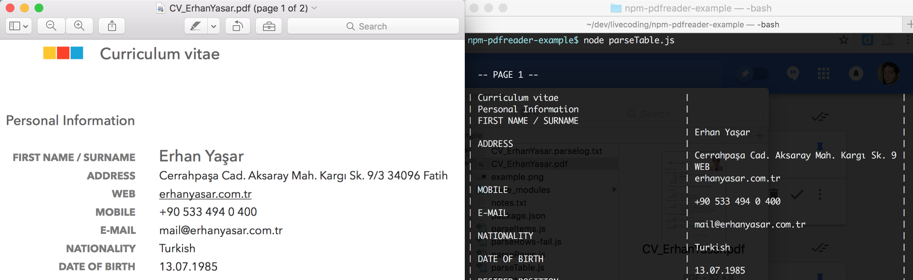

# Examples of use of [pdfreader](https://github.com/adrienjoly/npm-pdfreader)

## How to install and run

```sh
git clone https://github.com/adrienjoly/npm-pdfreader-example.git
cd npm-pdfreader-example
npm install
node parseItems.js
```

## 1. Parsing lines of text


Here is the code required to convert this PDF file into text:

```js
var pdfreader = require('pdfreader');

var rows = {}; // indexed by y-position

function printRows() {
  Object.keys(rows) // => array of y-positions (type: float)
    .sort((y1, y2) => parseFloat(y1) - parseFloat(y2)) // sort float positions
    .forEach((y) => console.log((rows[y] || []).join('')));
}

new pdfreader.PdfReader().parseFileItems('CV_ErhanYasar.pdf', function(err, item){
  if (!item || item.page) {
    // end of file, or page
    printRows();
    console.log('PAGE:', item.page);
    rows = {}; // clear rows for next page
  }
  else if (item.text) {
    // accumulate text items into rows object, per line
    (rows[item.y] = rows[item.y] || []).push(item.text);
  }
});
```

## 2. Parsing a table



Here is the code required to convert this PDF file into a textual table:

```js
var pdfreader = require('pdfreader');

const nbCols = 2;
const cellPadding = 40; // each cell is padded to fit 40 characters
const columnQuantitizer = (item) => parseFloat(item.x) >= 20;

const padColumns = (array, nb) =>
  Array.apply(null, {length: nb}).map((val, i) => array[i] || []);
  // .. because map() skips undefined elements

const mergeCells = (cells) => (cells || [])
  .map((cell) => cell.text).join('') // merge cells
  .substr(0, cellPadding).padEnd(cellPadding, ' '); // padding

const renderMatrix = (matrix) => (matrix || [])
  .map((row, y) => padColumns(row, nbCols)
    .map(mergeCells)
    .join(' | ')
  ).join('\n');

var table = new pdfreader.TableParser();

new pdfreader.PdfReader().parseFileItems(filename, function(err, item){
  if (!item || item.page) {
    // end of file, or page
    console.log(renderMatrix(table.getMatrix()));
    console.log('PAGE:', item.page);
    table = new pdfreader.TableParser(); // new/clear table for next page
  } else if (item.text) {
    // accumulate text items into rows object, per line
    table.processItem(item, columnQuantitizer(item));
  }
});
```

